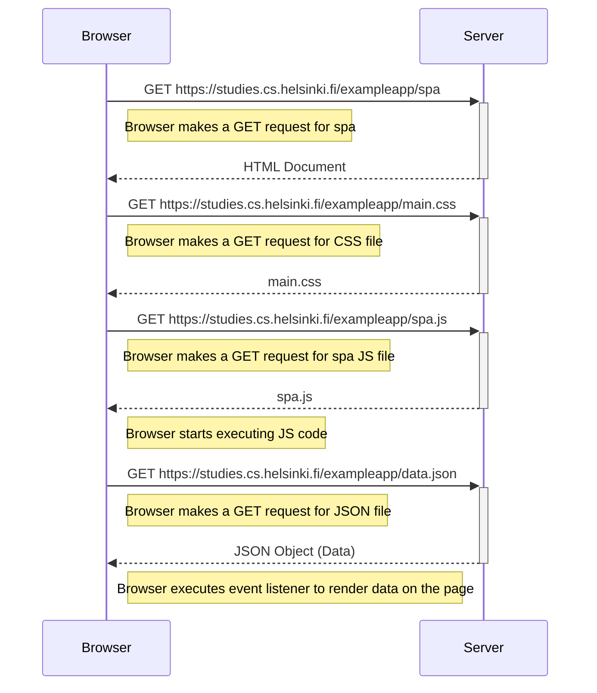

# Single Page App Diagram

```mermaid
sequenceDiagram
    participant Browser
    participant Server
    

    Browser->>+Server: GET https://studies.cs.helsinki.fi/exampleapp/spa
    Note right of Browser: Browser makes a GET request for spa
    Server-->>-Browser: HTML Document
    Browser->>+Server: GET https://studies.cs.helsinki.fi/exampleapp/main.css
    Note right of Browser: Browser makes a GET request for CSS file
    Server-->>-Browser: main.css
    Browser->>+Server: GET https://studies.cs.helsinki.fi/exampleapp/spa.js
    Note right of Browser: Browser makes a GET request for spa JS file
    Server-->>-Browser: spa.js
    Note right of Browser: Browser starts executing JS code
    Browser->>+Server: GET https://studies.cs.helsinki.fi/exampleapp/data.json
    Note right of Browser: Browser makes a GET request for JSON file
    Server-->>-Browser: JSON Object (Data)
    Note right of Browser: Browser executes event listener to render data on the page

```
