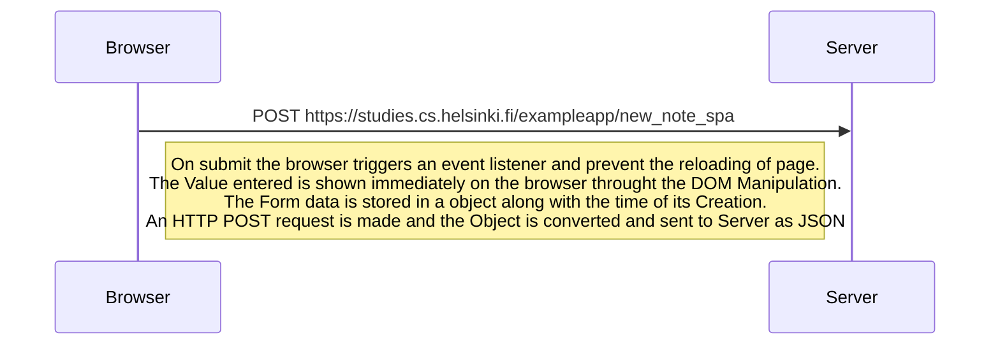

# Single Page App Diagram

```mermaid
sequenceDiagram
    participant Browser
    participant Server
    
    Browser->>Server: POST https://studies.cs.helsinki.fi/exampleapp/new_note_spa
    Note right of Browser: On submit the browser triggers an event listener and prevent the reloading of page.<br/> The Value entered is shown immediately on the browser throught the DOM Manipulation.<br/> The Form data is stored in a object along with the time of its Creation. <br/> An HTTP POST request is made and the Object is converted and sent to Server as JSON

```
